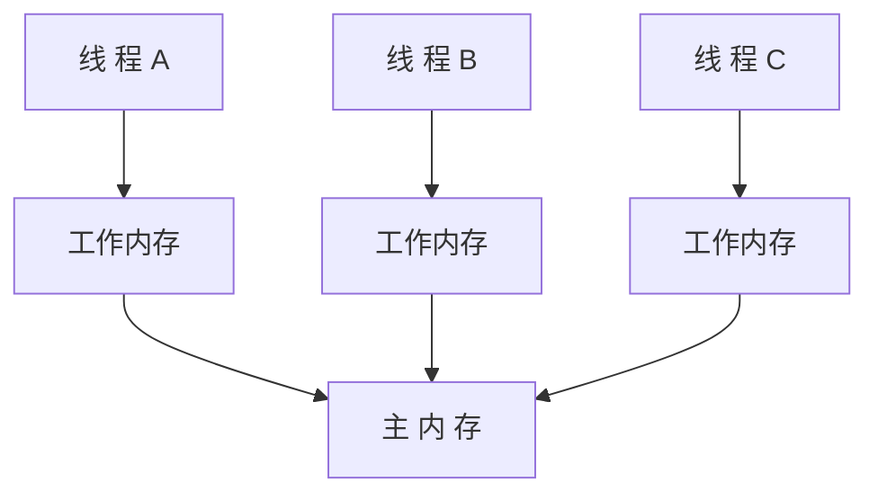

[TOC]

# 并发编程

## 1. 原子性

代码清单1：

```java
public class Test {
    
    private static int c;
    
    public void test(){
        c++;
        System.out.println(c);
    }
}
```

这种代码在单线程环境下，大家肯定都能知道输出结果为1。但是在多线程环境下，输出结果却是不确定的。假设A，B两个线程都执行test()，输出的结果可能都是1。

这是因为c++并非是一个原子操作。它的操作可以细分为：读取-修改-写入。


未作同步的情况下，A线程执行的c++的时候，读取到C的值为0，然后执行c++，将c的值改为1，但是如果在A写入内存（这里暂指主内存，而非线程工作内存）之前，B线程也开始执行，此时B读到的c也是0，最终结果A，B线程输出的结果都是1。要保证结果的正确性，做如下修改：

代码清单2：

```java
public class Atomic{
    //Atomic类可以保证多线程下的操作原子性，它使用了unsafe的CAS操作。
    private AtomicInteger c;
    
    public void test(){
        c.incrementAndGet();
        System.out.println(c);
    }
}
```

但是下面的代码就不能原子性：

代码清单3：

```java
if (!vector.contains(element)){
    vector.add(element);
}
```

这里Vector的虽然是线程安全的，`contains`和`add`虽然都是原子操作，但是这里组合起来就不是原子操作。A，B线程执行这段代码，A先执行`contains`然后执行`add`，但是在`add`方法执行过程中，B线程此时进入if判断，A还未执行完`add`，这样的结果是不正确的，会导致元素的重复添加。

**一句话总结：**复合操作不能保证原子性。原子性操作 + 原子性操作 ≠ 原子性操作。

### 1. 特例

Java中对于**long**和**double**（64位）类型的变量。JVM会将它的读操作或写操作分解成两个32位的操作。当变量没有被volatile修饰时，如果对该变量的读写在不同的线程中执行，那么就有可能读到某个值的高32位和另一个值的低32位。因此在多线程环境下使用**long**和**double**的话，要么加锁，要么使用volatile修饰变量。

## 2.可见性

> 线程可见性主要是因为Java内存模型是基于以下结构：



可以先看一下下面这段代码：

```java
public class Test{
    private static boolean flag;
    
    private static int number;
    
    public void test(){
        while(!flag){
            Thread.yield();
        }
        System.out.println(number);
    }
    
    public static void main(String[] args){
        Test test = new Test();
        new Thread(()->{
            test.test();
        }).start();
        number=32;
        flag=true;
    }
}
```

我们假设主线程为A，另一个线程为B。B线程读到的变量可能为以下几种可能：

1. flag=false、number=0
2. flag=true、number=0
3. flag=false、number=32
4. flag=true、number=32

对于结果1，3都是由于这段代码不能保证变量的可见性，A线程在赋值的过程中，可能B线程已经去读取变量的值了，这时肯定读不到A线程写入的值，此时B线程读到的值一般称为 **”失效值“** 。

对于结果2，这是由于**“指令重排序”**。在没有同步的情况下，编译器、处理器以及运行时可能对操作的执行顺序做一些调整。也就是说A线程可能是先执行`flag=true`,写入完成后，还未执行number=32时，此时B线程就已经读到到flag=true，number=0了。

结果4不说了。

