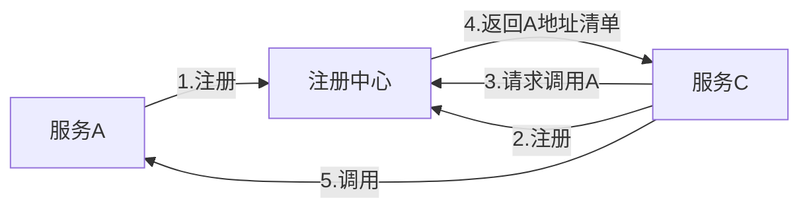

[TOC]

# 服务治理：Spring Cloud Eureka
#### 1. 简介
> Spring Cloud Eureka是Spring Cloud Netflix微服务套件中的一部分，它基于Netflix Eureka做了二次封装，主要负责完成微服务架构中的服务治理功能。它既包含了服务端组件，也包含了客户端组件，并且服务端与客户端均采用Java编写。所以Eureka主要适用于通过Java实现的分布式系统，或是与JVM兼容语言构建的系统。
#### 2.服务治理
* **服务注册**  
  在服务治理框架中，通常都会构建一个注册中心，每个服务单元向注册中心等级自己提供的服务，将主机与端口号、版本号、通信协议等一些附加信息告知注册中心，注册中心按服务名分类组织服务清单。  
  比如：A服务和B服务启动后，向注册中心注册自己的服务后，注册中心就会维护类似下面的一个服务清单。**另外，服务注册中心还需要以心跳的方式去检测清单中的服务是否可用，若不可用需要从服务清单中剔除，达到排除故障服务的效果。**  

    服务名| 位置
    :------:|:----:
    服务A|192.168.0.100:8000 192.168.0.101:8000
    服务B|192.168.0.100:9000 192.168.0.100:9001 192.168.0.100:9002

* **服务发现**  
  由于在服务治理框架下运作，服务间的调用不再通过指定具体的实例地址来实现，而是通过向服务名发起请求调用实现。假如C服务现在要调用A服务，注册中心就会将服务A的位置清单返回给服务C，然后C从清单中以某种轮询策略取出一个位置进行服务调用，这就是后续会接触到的客户端负载均衡。  


#### 3.搭建服务注册中心
工程的pom.xml如下：
```xml
    <parent>
        <groupId>org.springframework.boot</groupId>
        <artifactId>spring-boot-starter-parent</artifactId>
        <version>1.5.10.RELEASE</version>
    </parent>
    <dependencyManagement>
        <dependencies>
            <dependency>
                <groupId>org.springframework.cloud</groupId>
                <artifactId>spring-cloud-dependencies</artifactId>
                <version>Edgware.SR3</version>
                <type>pom</type>
                <scope>import</scope>
            </dependency>
        </dependencies>
    </dependencyManagement>

    <dependencies>
        <dependency>
            <groupId>org.springframework.cloud</groupId>
            <artifactId>spring-cloud-starter-eureka-server</artifactId>
        </dependency>
    </dependencies>
```
启动类：
```java
@SpringBootApplication
@EnableEurekaServer
public class EurekaApplication {

    public static void main(String[] args) {
        SpringApplication.run(EurekaApplication.class,args);
    }
    
}
```
applicaiton.yml:
```yml
spring:
  application:
    name: eureka-server
server:
  port: 9999

eureka:
  server:
    enable-self-preservation: false
  instance:
    hostname: localhost
  #使用register-with-eureka和fetch-registry都为false来表明自己为一个eureka server
  client:
    register-with-eureka: false
    fetch-registry: false
    service-url:
      defaultZone: http://${eureka.instance.hostname}:${server.port}/eureka/
```
#### 4.高可用注册中心
**Eureka Server的高可用实际上就是将自己作为服务向其他服务注册中心注册自己**，这样可以形成一组互相注册的服务注册中心，以实现服务清单的互相同步。达到高可用的效果。
* 创建application-peer1.yml，作为peer1服务中心的配置，并将serviceUrl指向peer2：
```yml
spring:
  application:
    name: eureka-server
server:
  port: 1111

eureka:
  server:
    enable-self-preservation: false
  instance:
    hostname: peer1
  #使用register-with-eureka和fetch-registry都为false来表明自己为一个eureka server
  client:
    serviceUrl:
      defaulZone: http://peer2:1112/eureka/
```
* 创建application-peer2.yml，作为peer1服务中心的配置，并将serviceUrl指向peer1：
```yml
spring:
  application:
    name: eureka-server
server:
  port: 1112

eureka:
  server:
    enable-self-preservation: false
  instance:
    hostname: peer1
  #使用register-with-eureka和fetch-registry都为false来表明自己为一个eureka server
  client:
    serviceUrl:
      defaultZone: http://peer1:1111/eureka/
```
* 在消费者工程中的配置为：
```yml
    eureka:
        client:
            serviceUrl:
                defaultZone: http://peer1:1111/eureka,http://peer2:1112/eureka
```